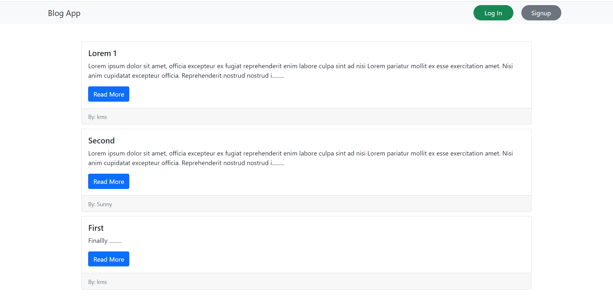
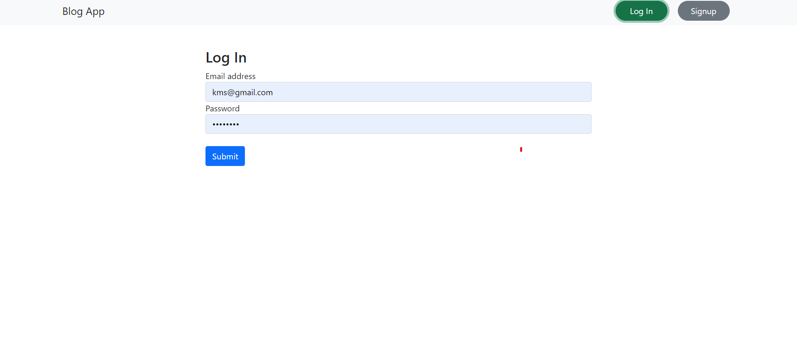
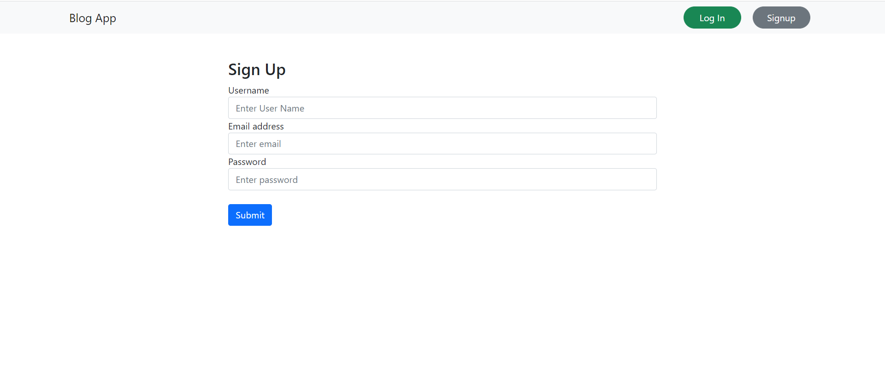
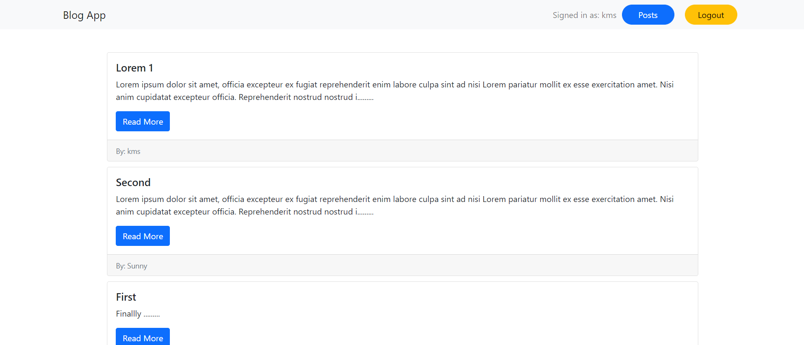
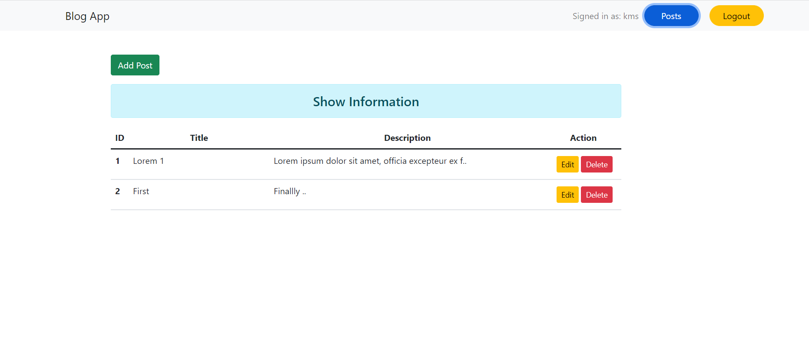
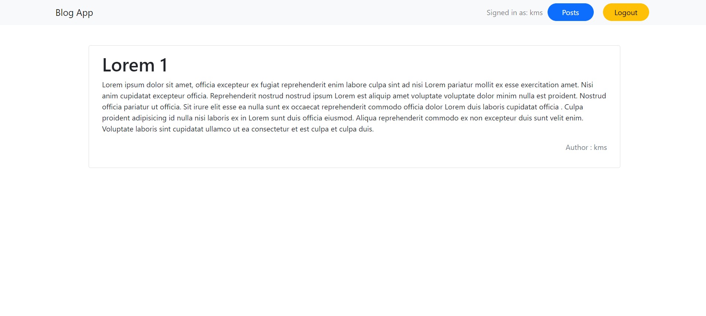

<div align="center">

# Login Api
# Node-Js Rest Full Api

#
</div>

## Run Locally

### 1. Clone repo

```
$ git clone https://github.com/shubham9672/React-Blog-Web.git
$ cd React-Blog-Web
```
### 2. Setup & start project

```
$ npm install
$ npm run dev // To start the api from json file or u can run json-server --watch src/db.json --port 8000 in terminal 
// In new terminal
$ npm start
```
## Project ScreenShot's
### Home Page 
<p align="center"></p>

### User Login & Signup 

<p align="center"></p>
<p align="center"></p>

### Home Page after login

<p align="center"></p>

### All Post Written by user

<p align="center"></p>

### Post Page

<p align="center"></p>


